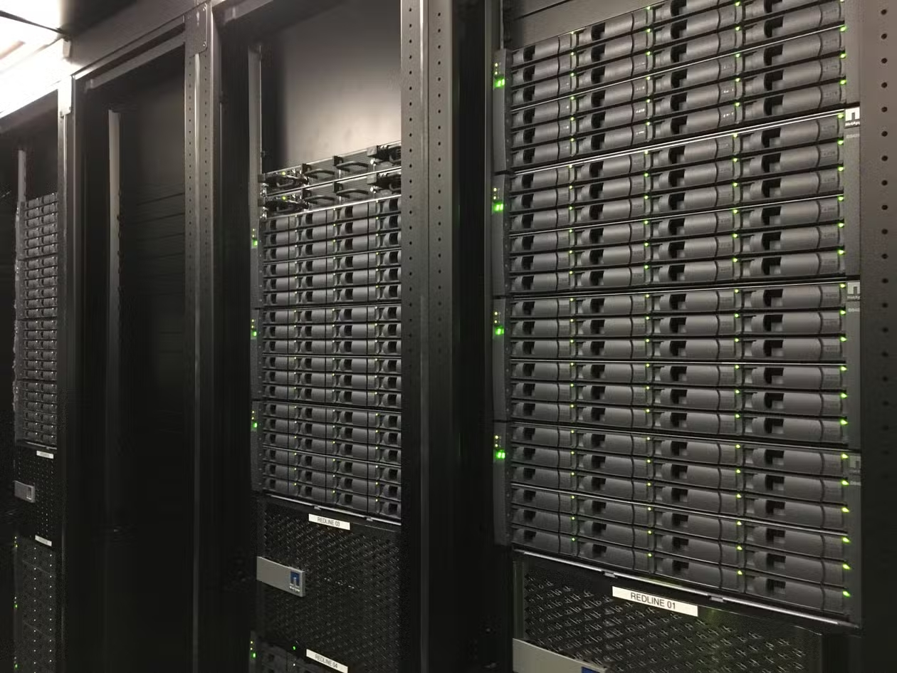

# L’Archivage du Web en France :

**Photographie du serveur d'Internet Archives de la BNF**

*Crédits : Morgan Tual, Le Monde*

# Enjeux et contexte de l’archivage du Web :

Initié par le chercheur Tim Berners-Lee en 1989, le Web s’est imposé comme un outil quotidien 
support de données variées auxquels ont accès et/ou produisent des milliards d’utilisateurs à travers le monde. Le Web
n’a pas cessé d’évoluer ces vingt dernières années, son architecture a
été transformée et son emploi démocratisé[^1]. D’abord envisagé pour des
chercheurs, c’est un public large qui s’est investi de ce service en
participant lui-même à l’évolution de ce contenu. L’analyse du web
permet de comprendre les sociétés contemporaines, ses enjeux et ses
évolutions. Dans les années 1990, des historiens ont commencé à
s’intéresser au Web. Les premiers travaux ont exposé les freins liés à
cette pratique : l’instabilité et la pérennité des données pose un
véritable défi pour les historiens. Elles sont en effet volatiles,
évoluent voire disparaissent. Leur disparition est matérialisée par le
renvoi d’un message d’erreur 404. Ainsi, tout comme une charte de
l’époque médiévale est altérée par le temps et dépend des conditions
matérielles de conservation, les sites Web se transforment ou
disparaissent tous les quatre-vingts jours en moyenne[^2]. De ce fait,
la conservation au sens du latin *conservare* prend tout son sens.
Pourtant, la question de comment récupérer et stocker sans altérer le
nombre important de données qui structurent une page Web se pose. Sous
quelles formes conserver ces données ?

Conscients de ces enjeux, c’est d’abord un acteur privé, Brewster Khale,
qui se lance dans un projet visant à archiver le Web en créant la
fondation Internet Archive en 1996. C’est par l’utilisation de robots
*crawler*[^3] qu’il se lance dans une première copie de sites variés,
qui concernent l’élection présidentielles de 1996 opposant Bill Clinton
à Bob Dole, avant de continuer en élargissant son œuvre. Il est possible
de saisir les enjeux de construction de la mémoire nationale qui
sous-tend ce premier projet dont l’entendu est important. En effet, une
élection mobilise un large panel d’acteurs de la vie politique et civile
qui sont au fait de l’ensemble de moyens qui permettent de toucher
l’électorat, *a fortioti* dans un pays où le vote n'est ni figé, ni
prévisible dans les *swing states*. Khale est souvent présenté comme
« un visionnaire, humaniste militant »[^4]. En effet, dans la stratégie
médiatique qu’il tente d’imposer pour publiciser son projet, il évoque
sa volonté de constituer « une bibliothèque numérique universelle »[^5],
à l’image de la Bibliothèque d’Alexandrie. Ce n’est donc pas anodin
qu’une copie des données ait été envoyés à la bibliothèque d’Alexandrie.

Dès lors, alors que des enjeux patrimoniaux et mémoriaux sous-tendent la
question de l’archivage du Web, comment laisser un acteur privé archiver
le Web d’états ? On voit donc se lancer dans des projets d’archivage du
Web à l’initiative de bibliothèques nationales plusieurs pays. Ainsi, la
Bibliothèque Nationale de Suède qui en 1997 entreprend une collecte à
partir des sites répertoriés sur un nom de domaine national. Cette
entreprise importante passe rapidement par la collaboration, c’est ainsi
qu’à l’échelle européenne, le *Network European Deposit Library* est
initié dans le cadre du programme de recherche et développement de l’UE
reposant sur la collaboration de neuf bibliothèques, trois maisons
d’éditions ainsi que des entreprises d’informatiques.

En France, la question de l’archivage des productions mobilise
directement la Bibliothèque nationale de France et l’Institut national
de l’audiovisuel qui sont en charge du dépôt légal. Cette entreprise à
une visée mémorielle. Il semble donc naturel que la charge d’archiver le
Web français leur ait été confié.

Dans quelle mesure la nature évolutive et complexe du Web a-t-elle
modifié les pratiques de conservation et de valorisation de la BnF et de
l’INA ? Comment les acteurs politiques mais aussi la BnF et l’INA
envisagent-elles ces archives de nature numérique ? Quelles sont les
modalités et les acteurs de l’archivage du Web français ? En quoi
l’archivage du Web a-t-il également modifié les pratiques des historiens
considérés dans le processus d’archivage ? Quelles sont les politiques
de valorisation des collections ?

# Étendre les prérogatives de la BnF et de l’INA : les enjeux politiques et juridiques de l'élargissement du dépôt légal. 

La France connaît depuis 1537 le dépôt légal des documents. Il implique
que l’ensemble des documents édités qui sont produits ou qui touchent la
France, soient données à des autorités de conservation qui sont la
Bibliothèque nationale de France et l’Institut national de
l’audiovisuel. Ce dépôt a une véritable dimension patrimoniale. Il a été
élargi à mesure où les pratiques de production ont évolué. Ainsi, par
exemple, à la suite de la surpression du monopole étatique sur les
contenus dans les années 1980, il est nécessaire, dans une visée
patrimoniale et mémorielle de préserver les programmes nouveaux
d’acteurs inédits sur le champ audiovisuel national. C’est ainsi que les
législateurs s’emparent de la question en [1992].(https://www.legifrance.gouv.fr/jorf/id/JORFTEXT000000723108#:~:text=1er.,la%20disposition%20d'un%20public)).

## Une vision économique du Web : les prémices de l’archivage du Web
  

Les débats politiques se concentrent d’abord sur la question des
internautes français avec l’établissement du programme d’action
gouvernemental de la société d’information, à l’initiative du
gouvernement L. Jospin en 1997. Celui-ci n’aborde aucunement les enjeux
patrimoniaux et mémoriels sur le WEB et pour cause, le projet est piloté
par le ministère de l’Économie, des Finances et de l’Industrie. Le Web
est d’abord envisagé comme « un facteur de croissance économique »[^6].
Il y a derrière une volonté de protection des internautes et des données
qu’ils produisent, notamment en ce qui concerne les industriels.

Parallèlement, l’État confie l’archivage de ses premiers sites[^7] à la
fondation privée d’Internet Archives en 1996. Se pose donc le souci que
des informations politiques relatives à la mémoire d’un pays se
retrouvent hébergés sur des serveurs aux États-Unis, fait prendre
conscience aux acteurs politiques que cette activité devrait être le
fruit de l’État lui-même. Il est alors convenu qu’une prochaine loi sur
la société de l’information prendra en considération ces éléments.

Ainsi, quand le projet de loi est proposé par le gouvernement à
l’Assemblée Nationale en mars 2000, toujours pilotée par L. Fabius,
ministre de l’économie et des finances, une réflexion autour de
l’archivage du Web français émerge. Il serait question d’élargir le
dépôt légal au Web afin d’en archiver ses contenus[^8]. Mais, du fait
d’un calendrier parlementaire serré, ces discussions n’aboutissent pas à
des amendements[^9]. Pourtant ces discussions permettent de lever
quelques questionnements. D’abord, il s’agit de définir une personnalité
juridique au Web. Il s’agit de l’ensemble « des signes, signaux, écrits,
images, sons ou messages, de toute nature faisant l’objet d’une
communication publique en ligne »[^10]. Ensuite, il est question de la
méthode très concrète pour comprendre ce qu’il faudrait archiver et sur
quelle unité se baser, c’est-à-dire, faudrait-il archiver la page, le
site ou bien uniquement le document ? Ensuite, le souci est lié au fait
qu’Internet est considéré comme une source de croissance économique. Il
ne faudrait donc pas que le dépôt légal soit à la charge des acteurs
producteurs, mais davantage celle de l’État. Enfin, c’est la question
plus large du droit d’auteur qui est abordée.

## L’établissement difficile de la loi Dadvsi témoin de visions différentes autour du Web. 
  

C’est à l’échelle européenne que les choses s’accélèrent. Une directive
du Parlement européen et du Conseil du 22 mai 2001[^11] relative à
l’harmonisation de certains aspects du droit d’auteurs et des droits des
voisins dans la société de [l’informatio]n (<https://www.legifrance.gouv.fr/jorf/id/JORFTEXT000000523361>). En vue
de son adaptation dans le droit national français, un Conseil supérieur
de la propriété littéraire et artistique est créé. Un premier paradoxe
apparait : pourquoi, alors que le dépôt légal est historiquement lié aux
institutions publiques, archivistiques et documentaires, aucun acteur du
secteur archivistique, des bibliothèques ou de la documentation n’y
siège ? La loi est présentée par le gouvernement et par les médias comme
liée à Internet, justifiant ainsi une exclusion de ces acteurs. Le texte
qui éclot de cette discussion entre le CSPLA et le Conseil des ministres
prévoit que seuls la BNF et l’INA sont habilités à copier « les contenus
en ligne selon un mode d’échantillonnage permettant de constituer
progressivement une mémoire collective »[^12], sans que les
bibliothèques ne puissent y avoir accès[^13]. Une association
archives-bibliothèque-documentation est alors créée en 2002 afin de
revendiquer leur position sur ce texte. Elle prend une ampleur assez
importance, ce qui fait que les forces politiques s’emparent de leurs
revendications au Parlement. Ils souhaitent véritablement trouver un
équilibre entre une protection des productions, et une ouverture pour un
accès culturel. L’idée est d’autoriser les exceptions prévues par le
Parlement européen à savoir, permettre à l’ensemble des institutions
patrimoniales françaises (musées, bibliothèques, archives française) de
reproduire à des de conservation et de communication et à des buts
pédagogiques. Ce qu’on observe donc c’est que ces acteurs patrimoniaux
ont conscience que le Web est nouveau patrimoine et qu’il constitue un
enjeu mémoriel et qu’il pourra être exploité à des fins pédagogiques et
scientifiques.

Après des débats qui aboutissent à l’établissement d'une commission
mixte paritaire et la saisine du Conseil constitutionnel, la loi Dadvsi
est promulguée au Bulletin Officiel le 3 août 2006. Elle aura opposé,
non pas des couleurs politiques, mais bien plusieurs élus locaux très
investis des revendications portées par ces associations. Par rapport au
projet originel du gouvernement, la loi protège strictement les
producteurs, mais élargit les exceptions. Ainsi, les bibliothèques,
musées et services d’archives sont autorisés à reproduire certaines
données à condition qu’elles n’aient pas de visée commerciale. Ainsi, la
BNF et l’INA sont considérés comme les instances légitimes à l’archivage
des sites web et documents dématérialisés (à savoir logiciels et bases
de données). La BNF est aussi « dépositaire des fichier numériques des
éditeurs qui sont mis à disposition d’organismes agrées pour la
réalisation d’éditions adaptées aux publics handicapés »[^14].

## Définir le « Web français » et un périmètre d’action : lesressorts du décret d’application de 2011.

Il faut attendre le décret d’application de décembre 2011[^15], pour que
l’ensemble « des signes, signaux, écrits et images, sons ou messages de
toute nature faisant l’objet d’une communication par voie
électronique », c’est-à-dire qu’un grand nombre de fichiers à
destination du public, sont visés par la collecte. Ainsi, on note une
première limitation de ces moissonnages qui ne touchent ni les
correspondances privées ou les espaces privées hébergés sur le web.
Ensuite, il a été question d’établir ce qui est considéré comme un site
français. Cette disposition est intrinsèquement liée à l’origine
historique du dépôt légal. Ainsi, il a été décrété que les dites
« enregistrés sous le nom de domaine .fr ou tout autre nom de domaine
enregistré auprès des organismes français chargés de la gestion de ces
noms, et/ou produits sur le territoire français ou enregistrés par une
personne domiciliée en France »[^16]. Afin d’affiner ce protocole, La
BNF fait appel à l’Association française pour le nommage internet en
coopération (Afnic) qui est chargé d’attribuer les noms de domaine. Le
robot peut aussi en réalité crawler les sites qui ont un autre nom de
domaine comme *.com* ou *.org* si leur contenu a été produit en France.
Le décret prévoit également que ces informations sont vérifiées à
posteriori de la collecte. Ainsi, une marge de manœuvre est laissée à la
fois à la BnF et aux éditeurs.

Ainsi, malgré une définition difficile, la loi et son décret
d’application traduisent parfaitement la vision du Web comme faisant
partie intégrante du patrimoine français qu’il faut conserver et qui
constitue une entrée de premier plan dans la compréhension des sociétés
contemporaines.

# Les enjeux techniques de la collecte : préserver, conserver et valoriser le patrimoine français.

Une fois le cadre légal établit, on peut penser que la question de
comment concrètement archiver ce qu’on considère comme le Web français
doit être posée. Il faut aussi mener une réflexion autour de ce qu’on
considère comme étant une archive du Web. Comme le montre Schafer,
Muisiani et Borelli en 2016, elle ne constitue aucunement un objet
statique et elle dépend des modalités de la collecte, des technologies
mais aussi « des modèles et paradigmes qui sous-tendent
l’archivage »[^17] et la conservation. Ce qu’on entend par là, c’est que
le Web ne va pas être archivé de la même manière s’il a pour but de
servir un modèle documentaire, mémoriel ou encore temporel. Pour autant,
pour Niels Ole Finneman, il y aurait tout de même une convergence des
méthodes déployées par les États et les institutions compétentes autour
de la question d’archives du web : obtenir par la collecte un contenu
original et ses évolutions, ainsi qu’une visée d’exploitation et
d’analyse par des spécialistes. On retrouve totalement cette vision avec
la loi Dadvsi.

Plus largement, comment dépasser les problèmes techniques définis par
Howard Besser[^18] liés à la préservation du numérique, à savoir le
stockage et la maintenance concrète des archives, l’intégrité du
document et de son contexte, la pratique d’acquisition, et la perte
d’information lors de la migration d’un support vers un autre.

## Le moissonnage large des sites : vers une représentativité du web ?

La BnF s’est dotée d’une cinquantaine de robots moissonneurs qui sont
chargés deux fois par an, d’identifier et de copier automatiquement les
fichiers en ligne dans les dispositions du décret d’application de 2011.
On pourrait comparer cette démarche à celle d’un utilisateur qui
cliquerait sur tous les sites qu’ils rencontrent. Elle utilise la
technologie *Heritrix* développée par Internet Archive. Très
concrètement, ce robot moissonneur fait ce qu’on appelle du *web
scrapping*. Il est chargé de collecter le code source, la mise en page
CSSS, les fichiers HTML ou encore les fichiers binaires (photos,
vidéos…). En fonction des collectes, un paramétrage des robots est
établi : on précise la profondeur, la date, la qualité et l’étendu de la
collection. Collecter en profondeur signifie que les robots récupèrent
les liens entrants qui sont à l’intérieur d’un site et collecter en
largeur que ce sont les liens sortants vers d’autres sites qui sont
récupérés. Pour autant, ce moissonnage est limité pour des raisons
pratiques liées au stockage. Il peut également être limité par les
producteurs qui peuvent tout à fait intégrer dans leur site un protocole
d’exclusion des robos qu’on appelle *robots.txt*[^19].

Aussi, à l’image d’une conservation classique, il y a un contrôle
pendant de la collecte autour de la qualité à l’aide d’un échantillon
sur lequel on analyse le poids, la taille ou la répartition des
collections par types de fichier. Il y a aussi des technologies qui
permettent d’éviter le dédoublement et de vérifier que l’URL est encore
en ligne.

Une fois collectés, sont stockés sur un format propre aux archives du
Web, des fichiers ARC sur lesquels on retrouve le fichier issu du
moissonnage compressé ainsi qu’un ensemble de métadonnées comme la date
de capture, le poids…. Ensuite, ces fichiers ARC sont stockés sur des
disques appelés Petabox d’une capacité d’entre 60 et 120 téraoctets.
C’est bien à partir de ces disques qu’on peut consulter les archives.
Pour autant, la BNF est avant tout une instance de conservation. Dès
lors, ces fichiers ARC sont copiés et sauvegardés dans un système appelé
Spar (Système de préservation et d’archivage réparti). C’est à cette
étape qu’intervient la normalisation des données en vue de
l’interopérabilité. En effet, il faut que ces fichiers suivent le modèle
de *l’Open Archival Information System*. Ainsi, chaque fichier doit
recevoir un identifiant et une validation et chaque fait l’objet de
migration et d’émulation afin de pouvoir rester lisibles sur le long
terme.

Le signalement de données repose sur des normes établies à l’échelle
internationale depuis 2008. Il est véritablement nécessaire à
l’interrogation des données. C’est environ deux semaines après une
capture, qu’il est possible de naviguer à l’aide de la Wayback machine
de la BNF, de naviguer sur le web dit vivant. Ces outils sont évidemment
à disposition des chercheurs entre les murs de la BNF.

On retrouve la même logique en ce qui concerne l’INA, à la différence
que la masse de sites est différente puisque ce sont environ 14 000
sites[^20] qui sont quotidiennement moissonnés.

On voit donc bien une adaptation claire du processus d’archivage et de
conservation de ces sites issus du Web, mais qui reste tout de même dans
les logiques des institutions patrimoniales.

## Les collectes ciblées : un processus sélectif révélant les enjeux d’une construction mémorielle :

À côté de ce moissonnage large, il existe un modèle de section ciblé.
C’est d’ailleurs par ce modèle que la BNF a débuté son expérimentation
d’archivage du Web, bien avant le cadre légal, au début des années 2000.

Des premières collectes ciblées sont effectuées entre 2002 lors des
élections présidentielles, régionales et européennes. Pour autant, elle
a impliqué da manière active dans ce processus Internet Archive. Ces
sont au total 3500 sites qui ont été moissonnés lors des deux collectes
effectuées. La collecte est donc thématique, ce qui a nécessité un
paramétrage précis qui est passé par la création d’un comprenant 18
acteurs de différents départements de la BNF notamment appartenant au
département d’Histoire, de Droit et Science politique et celui du dépôt
légal. Ces acteurs, aux visions différentes ont réussi à établir ce que
Catherine Lupovici appelle « une typologie de sites », afin de cibler
les sites. Ce sont des productions d’organisation politiques, de
candidats, de médias satiriques, humoristique ou traditionnels,
d’institutions officielles, d’observatoire, du net-citoyenneté ou encore
d’enseignement et recherche qui seront moissonnés. C’est tout de même
une méthode de prospection qui est établie et qui évolue au fur et à
mesure de la campagne, notamment au moment de l’entre-deux-tours où une
forte mobilisation du Web est constaté notamment par l’investiture du
Web par le « front-républicain ». Ce sont en 2002, 50 000 URL qui ont
été sélectionnées couvrant à la fois les élections des primaires à la
fin du deuxième tour. Les captures des sites validés ont été effectuée à
plusieurs fréquences en fonction de l’importance de participation des
sites dans l’élection. Par exemple, les sites des candidats ou des
partis ont été collectés plusieurs fois par semaine, ceux des médias,
une fois par semaine pendant le premier tour et trois fois pendant le
second tour[^21].

Cette pratique s’est ensuite imposée et élargit notamment du fait des
évolutions dépôt légal et des pratiques de campagne électoral et
l’utilisation des médias sociaux.

La collecte ciblée repose donc sur le choix de sites par des
bibliothécaires qui vont par ailleurs suivre la même logique de
paramétrage des robots *crawler*. Ils sont donc des acteurs essentiels
dans la construction de la mémoire collective. Ils sont amenés à
réfléchir sans cesse à la granularité et à la temporalité des
productions. En effet, les sites des médias vont requérir une capture
hebdomadaire en surface, alors que le site de Matignon, une collecte
biannuelle en profondeur. Il existe deux types de collectes ciblés qui
répondent chacun à des enjeux différents et qui impliquent une
intervention forte des conservateurs et bibliothécaires.

D’une part, il y a les collectes dites « projets » qui peuvent être le
fruit d’une collaboration institutionnelle entre des partenaires variés
et qui va être sensible à la fois à l’actualité et mais aussi à des
thématiques qui peuvent répondre aux besoins de la recherche actuelle.
Citons en exemple une collecte a liée au Covid au moment du début de la
pandémie et du confinement. Son but est de comprendre le caractère
global, social et économique de la crise. Ce projet a été mené par la
BNF en partenariat avec quinze partenaires en région. C’est ensuite un
travail de valorisation qui a été fait puisqu’un parcours guidé a été
mis en ligne par les conservateurs et des chercheurs
(<https://www.bnf.fr/sites/default/files/2021-03/epidemie_Covid19_parcours.pdf>
). Parmi ces collectes projets, on compte notamment ce qu’on appelle les
collectes dites « d’urgences » qui ont la même dynamique qu’une
conservation d’urgence dans le sens où il s’agit de capturer rapidement
les sites à collecter à des dates précises ou qui pourraient
disparaître. On voit donc une prise de conscience dans ces pratiques de
la nature très éphémères des données sur le Web. Ainsi par exemple, en
2015, l’INA et la BNF ont lancé une collecte d’urgence autour de la
couverture médiatique des attentats et des réactions des internautes, à
la suite que des internautes comme le chercheur de l’université de York
Nick Ruest aient collectés des Tweets. Ces collectes ont véritablement
nécessité une adaptation rapide et donné lieu à une approche
quantitative des traces numériques des attentats.

D’autre part, il existe des collectes dites courantes qui sont également
ciblées. Il s’agit de collectes sur des sites de référence qui
permettent de garantir « une continuité patrimoniale »[^22]. On retrouve
donc ciblés par ces collectes des périodiques, de la musique, ou encore
des encyclopédies. Elles répondent aux politiques documentaires de
chacun des départements de la BNF et de l’INA.

# Utiliser les archives du Web : les enjeux méthodologiques des recherches à partir du Web français.
    
  ## Une collaboration poussée entre acteurs : entre standardisation et approfondissements.

Ce travail nécessite donc un ensemble d’acteurs importants à différentes
échelles, régionales, nationales mais aussi internationale. Dès 2003, la
BNF a fait partie des fondateurs du consortium international pour la
préservation de l’internet (IIPC) qui compte aujourd’hui plus de
cinquante membres. On note d’abord une collaboration technique puisque
les logiciels de moissonnages et permettant la consultation sont le
fruit d’une création commune. Ainsi, le format WARC (ISO 28500) qui
caractérise le stockage et la préservation des archives est issu de ce
*consortium*. Ceci permet également de réduire les coûts économiques
qu’engendrent ces nouvelles pratiques. C’est aussi plus globalement une
méthode de travail qui est promu autour notamment des questions de
métadonnées qui permettent la description des collectes. En vue de
l’interopérabilité, la question de la standardisation est nécessaire.
Or, il n’existe aucun cadre particulier et donc il a fallu créer
certaines normes que les institutions, à travers des luttes
d’influences, tentent d’imposer aux éditeurs de sites. Ces normes visent
notamment à une possibilité d’échanges mais aussi à améliorer les
conditions d’accès et de préservation. L’un des objectifs à terme est de
« d’encourager le développement et l’utilisation d’outils communs, de
techniques et des normes de création d’archives internationales [^23]».
En règle générale, le développement de la *FAIR data*[^24], une des
missions des institutions patrimoniales française est aussi de réfléchir
au partage des corpus[^25].

De plus, les institutions publiques, dans une volonté de s’adapter aux
évolutions du Web sont appelés à collaborer avec des plateformes qui
hébergent des contenus. Ainsi, en mai 2023, l’INA a signé un partenariat
important avec le réseau social TikTok. En effet, ce réseau social
permettrait un accès  privilégié à des tendances culturelles et
audiovisuelles matérialisées notamment par les *trends* qui
correspondent à des tendances qui naissent de partages de contenu entre
internautes. Ceci nécessite en réalité une révision des technologies de
*crawling*, ce qui a pour conséquence le recours à une aide de la part
des acteurs de la plateforme.

Enfin, le développement de la collaboration en vue de davantage
documenter les collectes passe par une écoute du public concerné par la
production à savoir les chercheurs qui seront les premiers à appréhender
ces masses importantes de données. Ainsi, régulièrement, des entretiens
oraux sont organisés et publiés par l’INA et par la BNF afin de répondre
à la transparence de la collecte, mais aussi pour discuter des limites
techniques. Généralement, ces entretiens ont lieu en amont de la
constitution des corpus ce qui permettrait selon V. Schafer et S. Gebeil
de s’assurer de la faisabilité d’accès aux données. Ceci est d’autant
plus important quand les projets sont transnationaux comme pour la
collecte du Web liée au COVDI-19, où les temporalités ne sont pas
identiques en fonction des pays. On peut aussi noter un nombre important
de journées d’études réunissant des acteurs variés dans une même idée
autour des thèmes de la patrimonialisation du Web français. Par exemple,
dès 2010, l’INA propose plusieurs ateliers de recherche méthodologiques
du dépôt légal du Web média.

Cette collaboration donne aussi lieu à des premiers travaux autour des
archives associant archivistes et historiens. On peut par exemple citer
le projet porté par Valérie Schafer « Web90 » autour du patrimoine et
des mémoires du Web dans les années 1990.

## Un nouveau rapport à l’analyse et au traitement des archives du Web français : entre continuité et adaptation des historiens.

Comme nous l’avons précédemment souligné, l’archivage du Web français
est avant tout pensé pour un public de chercheur. Ils sont intégrés
pleinement dans le processus de création d’archives et sont invités à
consulter ces archives entre les murs de la BNF. Pour autant, comment
produire un discours historique à partir de ces corpus ? Comment les
historiens prennent-ils en considération les spécificités de ces
collections ? Quelles sont les nouvelles contraintes et limites ?

Notons d’abord que comme nous l’avons souligné, les archives du Web sont
lacunaires et incomplètes à la fois du fait des enjeux de
représentativité des collectes de la BNF et de l’INA. Il peut manquer
des pages entières notamment quand il s’agit des premières
expérimentations d’Internet Archive récupérées par la BNF. De plus,
malgré la mise en place d’une navigation entre « web mort » et « web
vivant » permis par les archivistes de la BNF, l’interconnectivité entre
les sites est limitée du fait de temporalité différentes de moissonnage.
La « re-médiation »[^26] induite par le système de collecte puis
d’indexation a pour conséquence qu’au sein de l’archive coexistent des
éléments qui ont pu ne pas coexister sur le Web[^27].

Le rapport de l’historien à l’archive se retrouve modifié. En effet,
archiver revient à stabiliser mais aussi à figer un contenu. Or, une
archive du Web est vivante et remodelée selon des mécanismes qui
respectent à la fois des contraintes économiques, juridiques mais aussi
techniques. Il faut donc que l’historien appréhende ces contraintes et
processus dans son analyse. Ceci requiert notamment selon Sophie Gebeil
de passer par une ouverture interdisciplinaire aux sciences
informatiques et aux sciences de l’information afin de parvenir au mieux
à établir une méthodologie précise de critique documentaire. Elle
propose par ailleurs une méthodologie à partir du site de l’association
Génériques [www.generiques.org](http://www.generiques.org) dans le but
d’étudier les mémoires de l’immigration. Pour se faire, l’historienne a
débuté le dépouillement des corpus archivé, par la compréhension de sa
constitution et a ensuite confronté des versions archivées et
éventuellement à des sources complémentaires. Dans le cas de son étude,
elle a par exemple mené des enquêtes orales des acteurs de
l’association.

La complexité des données permet aux historiens d’aborder les corpus à
travers différentes approches. Ils peuvent adopter une approche dite
« par cas »[^28] c’est-à-dire envisager un corpus restreint, voire à
partir d’un seul site. Ainsi, l’historien peut se concentrer sur
l’historicité du contenu à travers sa production, ses producteurs et sa
temporalité. Mais au contraire, la masse de données peut à l’inverse
favoriser une lecture distante. On peut citer ici la thèse de Quentin
Lobbé qui travaille sur les e-diasporas à partir des forums Yabiladi.fr
qui a été archivé par l’INA. Il expose sa méthode comme étant « une
exploration désagrégée de corpus d’archives Web » à partir « de
sous-ensembles cohérents et auto-suffisant d’une page Web »[^29]. Il a
abordé la question de la représentativité des diasporas en ligne
notamment à travers une analyse réseau. Enfin, des projets qui reposent
souvent sur une collaboration entre chercheurs, ont envisagé une
approche mixte, c’est-à-dire abordant à la fois lecture distante et
étude qualitative en fonction des spécificités des découvertes et des
axes d’études. Par exemple, le projet *Polyvocal Interpretation of
Contested Colonial Heritage (2021/2023)* a entre autres envisagé la
médiatisation de la Marche pour l’égalité et contre le Racisme de 1983
propose une analyse distante des données archivées par l’INA permise par
des outils d’extractions et sémantiques performants afin de comprendre
les processus d’évolution de la médiatisation qui peuvent traduire des
demandes de reconfigurations mémorielles dans les politiques
culturelles.

Quelques travaux d’histoire sur :

1.  **La fabrique numérique des mémoires de l’immigration maghrébine sur
    le web français (1999-2014),Sophie Gebeil.**

2.  **Web Vivant et Web archive, aux sources de l’histoire nativement
    numériques. <https://amu.hal.science/hal-04058328v1/document>**

[^1]: On peut penser au « Web 2.0 » (T. O’Reilly) dont des interfaces
    d’échanges simplifiés ont permis de rendre accessible à un public
    non initié de naviguer sur les Web.

[^2]: Tim-Berners Lee, interviewé par le Journal Le Monde en avril 2016.
    <https://www.lemonde.fr/pixels/article/2016/10/26/vingt-ans-d-archivage-du-web-un-projet-titanesque_5020433_4408996.html>

[^3]: Robot qui explore et indexe automatiquement des pages web en
    collectant les données.

[^4]: Claude Mussou, « Et le Web devient archives : enjeux et défis »,
    *Le Temps des Médias*, n°19(2), pp.256-259.
    <https://doi.org/10.3917/tdm.019.0259>.

[^5]: Tim-Berners Lee, interviewé par le Journal Le Monde en avril 2016.
    <https://www.lemonde.fr/pixels/article/2016/10/26/vingt-ans-d-archivage-du-web-un-projet-titanesque_5020433_4408996.html>

[^6]: G. Piejut, « Quand le web devient une archive : la construction du
    cadre légal », *Web Cropora : explorer les archives de l’internet à
    la BnF,* 2024. <https://webcorpora.hypotheses.org/283>

[^7]: Celui de Matignon et de l’Élysée.

[^8]: G. Piejut, « Quand le web devient une archive : la construction du
    cadre légal », *Web Cropora : explorer les archives de l’internet à
    la BnF,* 2024. <https://webcorpora.hypotheses.org/283>

[^9]: Le calendrier parlementaire français tente de répartir l’analyse
    des projets et propositions de lois, eux-mêmes dépendants des
    groupes parlementaires qui ont une répartition de la parole. Cette
    loi est débattue à l’approche des élections présidentielles de 2002.

[^10]: Cette définition est gardée telle quelle dans la loi du 21 juin
    2004 relative à la confiance dans l’économie
    numérique.<https://www.legifrance.gouv.fr/codes/section_lc/JORFTEXT000000801164/LEGISCTA000006117684/>

[^11]: Directive 2001/29/CE

[^12]: Présentation par Jean-Jacques Aillagon, ministre de la Culture et
    de la Communication, du projet de loi au conseil des ministres du 12
    novembre 2003.

[^13]: On note en réalité une seconde exception liée à la copie et la
    traduction des données pour un public handicapé.

[^14]: Informations sur la page Web « dépôts légal » de la Bibliothèque
    nationale de France. <https://www.bnf.fr/fr/le-depot-legal>

[^15]: Décret n°2011-1904.
    <https://www.legifrance.gouv.fr/loda/id/LEGIARTI000025002917/2011-12-22/>

[^16]: G. Illen, « Le dépôt légal de l’internet en pratique : les
    moissonneurs du web », *Bulletin des bibliothèques de France,* 2008,
    n°6, pp. 20-27.
    <https://bbf.enssib.fr/consulter/bbf-2008-06-0020-004>

[^17]: F. Musiani. Archivage du Web, un enjeu de gouvernance
    (d'Internet). Presses Universitaires du Septentrion. *Clarisse
    Bardiot, Esther Dehoux, Emilien Ruiz (dir.) La fabrique numérique
    des corpus en sciences humaines et sociales*,
    2022. [⟨halshs-03912550⟩](https://shs.hal.science/halshs-03912550v1)

[^18]: M. Sitts, “ Digital Longevity”, *Digital Projects, a Management
    Tool for Preservation and Access,* Northeast document conservation
    center, 2000.
    <https://www.nedcc.org/assets/media/documents/dman.pdf>

[^19]: Informations trouvées en parcourant le site » robots.txt,
    Introduction au protocole d’exclusion des robots ».
    <https://robots-txt.com/>

[^20]: A. Foatelli, « L’archivage du web : un outil pour comprendre
    internet », *La Revue des médias*, INA, 2016.
    <https://larevuedesmedias.ina.fr/larchivage-du-web-un-outil-pour-comprendre-internet>

[^21]: C. Lupovici, « L’archivage de l’Internet à la Bibliothèqe
    nationale de France. Matériaux pour l’histoire de notre temps, 2005,
    n°79, pp. 82-84. <https://doi.org/10.3406/mat.2005.1049>

[^22]: G. Illen, « Le dépôt légal de l’internet en pratique : les
    moissonneurs du web », *Bulletin des bibliothèques de France,* 2008,
    n°6, pp. 20-27.
    <https://bbf.enssib.fr/consulter/bbf-2008-06-0020-004>

[^23]: T. Chaimbault, dossier documentaire intitulé : « l’archivage du
    Web », école nationale supérieure des sciences de l’information et
    des bibliothèqes.
    <https://www.enssib.fr/bibliotheque-numerique/documents/1730-l-archivage-du-web.pdf>

[^24]: Mons, 2018, *findable*, *accessible*, *interopable* et
    *reusable*.

[^25]: Voir le contrat de performance de la BNF 2022-2026.
    <https://www.bnf.fr/fr/contrat-de-performance>

[^26]: N. Brügger, « L’historiographie de sites Web : quelques enjeux
    fondamentaux », *Le Temps des médias*, 2012, n°18, 1, pp. 159-169.

[^27]: S. Gebeil, « Quand l’historien rencontre les archives du Web »,
    *Revue de la BNF*, 2016, n°53, 2, pp185-191.
    <https://doi.org/10.3917/rbnf.053.0185>.

[^28]: J.-C. Passeron, J. Revel, *Penser par cas*, Paris, l’École des
    Hautes Études en Sciences Sociales, 2005.

[^29]: Voir l’explication de sa thèse sur son site Web :
    <https://qlobbe.net/bio.html>

