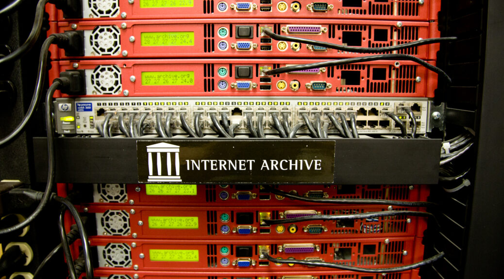

**L'archivage du Web en France**
**Photographie du serveur d'Internet Archives de la BNF**

*Crédits : Morgan Tual, Le Monde*

**Contexte**

*Le Web : un patrimoine volatile ?*

*Premières entreprises d'archivage : Internet Archives, NEDL*

**Les grandes étapes de l'archivage du Web français**

*Le dépôt légal*

*Former des acteurs*

*État des lieux aujourd'hui*

**Les enjeux patrimoniaux et mémoriels de l'archivage du Web français**

*Définir une stratégie de collecte*

**Archiver le Web social frnaçais**

