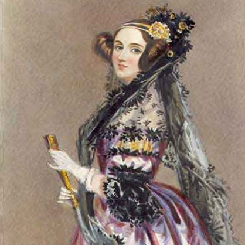
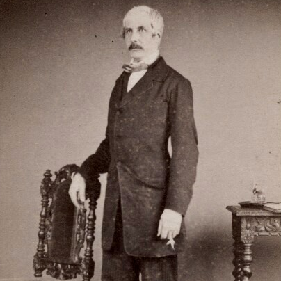
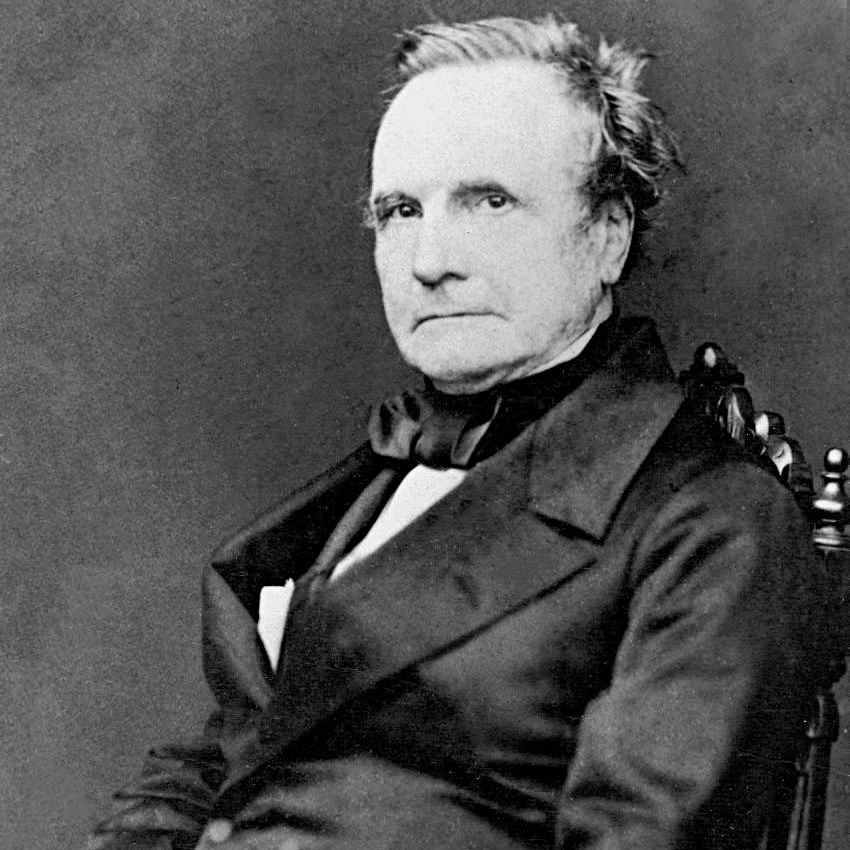
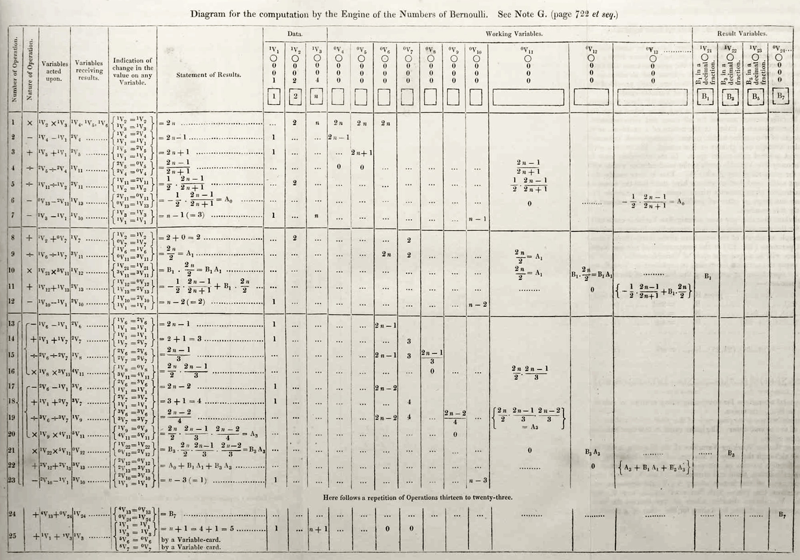

# Ada Lovelace et la machine de Babbage

Augusta Ada Byron, ou encore __Ada Lovelace__, est une mathématicienne du XIXe siècle notamment connue pour son investissement dans la *__Machine Analytique__* de __Charles Babbage__, mais aussi pour avoir traduit les travaux de __Luigi Federico Menabrea__.

Morte à seulement trente-six ans, elle a pourtant réussi à s’imposer au sein des cercles intellectuels de Londres grâce à son imagination remarquable, son intelligence intuitive et sa maîtrise des mathématiques.

 

 <b>Fig. 1 :</b> <i>Portrait of Ada King, Countess of Lovelace (Ada Lovelace)</i>, Alfred Edward Chalon, Science & Society Picture Library, 1838 

## Sa vie personnelle
### Son enfance

__Ada Byron__ naît le 10 décembre 1815 à Londres, avec pour mère __Annabella Milbanke__ et pour père __George Gordon Byron__, tous les deux des poètes qui se séparent en 1816.

Ce dernier s’intéresse occasionnellement à elle, en lui offrant par exemple des petits cadeaux ; durant l’été 1816, il lui donne un médaillon portant l’inscription italienne « les liens de sang sont plus forts que tout ». Il demande également à ce qu’Ada apprenne la musique ainsi que l’italien, une langue qu’Annabella et Byron aiment tous les deux, mais refuse catégoriquement qu’elle apprenne la poésie : en 1823, dans une lettre destinée à Annabella, il exprime son espoir qu’Ada n’aime pas la poésie, pour mourir l’année suivante le 19 avril 1824 de maladie en Grèce à Missolonghi.

> « *I hope that the Gods have made her [Ada] anything save poetical – it is enough to have one such fool in a family* », __BYRON George__ à __BYRON Annabella__, 12 octobre 1823.
> 
> Traduction : « J’espère que les Dieux l’ont faite de tout sauf poète – un seul idiot est suffisant dans une famille. »

Dès sa naissance, Ada est décrite par ses proches comme affectueuse, énergique, intelligente et joyeuse. Mais en mai 1829, après un épisode aigu de rougeole, elle devient alitée de manière chronique : pendant les trois années suivantes, elle ne peut que se déplacer en béquilles ou en fauteuil roulant. Mais durant sa maladie, elle est autorisée à lire tout ce qu’elle veut, et peut donc donner libre cours à son imagination exceptionnelle.

En 1830, Ada, alors âgée de quinze ans, est donc déjà trilingue, possède un admirable arsenal de connaissances géopolitiques et historiques – en partie grâce à sa mère – et est bien avancée en arithmétique basique, bien qu’elle ne puisse pas non plus être considérée comme un prodige.

### Son mariage

En fin mai 1835, Ada rencontre __William King__, un homme âgé de onze ans de plus qu’elle et qui adore Byron, durant une soirée organisée par __Lady Philips__. Ils s’entendent dès le début, et William demande sa main en mariage en juin ; quelques mois plus tard, en automne, ils se marient tous les deux. Les premières années du mariage se déroulent bien, comme l’atteste l’échange épistolaire entre Ada et William qui témoigne d’une vie sexuelle active.

 
 

 <b>Fig. 2 :</b> Photographie de William King, Henry Hering, National Portrait Gallery, vers 1860 

Ada tombe ensuite enceinte à plusieurs reprises, mais après cinq ans de mariage, Ada admet à Annabella qu’elle aurait préféré ne jamais avoir d’enfant, son intérêt pour la science nettement supérieur à celui qu’elle voue à la maternité.

### Ses débuts intellectuels

L’imagination et l’esprit entreprenant et inquisiteur d’Ada ont occasionnellement été jugés inconvenables, notamment par sa mère Annabella. En 1834, celle-ci engage par exemple un tuteur de mathématiques, espérant en vain que l’enseignement de cette discipline permettrait de rendre sa fille plus docile.

Mais la curiosité insatiable d’Ada est comprise par __Mary Montgomery__, une femme intelligente dotée d’une certaine empathie, qui décide d’introduire Ada aux cercles intellectuels de Londres. Or, les discussions scientifiques les plus intéressantes de la capitale se déroulent souvent en privé, durant des petites soirées organisées au sein même des maisons des scientifiques.

Le 19 mars 1834, Montgomery emmène ainsi Ada dans une maison à Dorset Street, juste à côté de Manchester Square : c’est la maison londonienne privée de __Charles Babbage__.

## La machine inachevée
### Charles Babbage

__Charles Babbage__, né en 1791 à Londres, est un homme ambitieux et inventif ayant été particulièrement malade durant sa jeunesse – comme Ada.

En 1820, Babbage aide son ami __John Herschel__, astronome, à créer la Royal Astronomical Society ; il travaille avec lui sur plusieurs tables de mathématiques, ces dernières étant à l’époque des éléments centraux de la science. Cependant, les erreurs de calcul étaient courantes, ce qui fait éventuellement germer en Babbage l’idée d’une machine à calculer à vapeur, capable de calculer automatiquement les valeurs : c’est la *__Machine à Différences__*, qu’il remplacera une décennie plus tard par la *__Machine Analytique__*, le précuseur des ordinateurs modernes.

La Machine à Différences est uniquement capable de faire des additions, tandis que la Machine Analytique est conçue de sorte à pouvoir effectuer n’importe quelle opération arithmétique en utilisant des instructions provenant de cartes perforées.

Le 3 juillet 1822, Babbage montre les premières esquisses de sa machine à __Sir Humphry Davy__, chimiste et physicien ; et en 1823, il parvient à persuader le gouvernement britannique d’investir dans sa machine. C’est une machine complexe et dynamique, dans laquelle il cherche à investir tout son génie inventif.

En 1827, Babbage perd une fille, un fils, sa femme et son père ; la construction de sa Machine Analytique représente alors une distraction bienvenue.

 

 <b>Fig. 3 :</b> Photographie de Charles Babbage, 1860 

Il n’arrive cependant plus à obtenir davantage d’argent de la part du gouvernement, et lorsqu’on lui fait remarquer en 1833 qu’on aurait pu construire deux navires de guerre au lieu de lui prêter 15 000 £, Babbage rétorque qu’il a lui-même investi le double de cette somme dans sa machine.

### Une amitié intellectuelle

Suite à la soirée du 19 mars 1834, Ada revoie et écrit régulièrement des lettres à Babbage : c’est le début de leur amitié. Babbage permet à Ada de se faire tutorer en mathématiques par __De Morgan__, connu pour avoir écrit plus de 700 articles de mathématiques, et tente également de rapprocher Ada de __Michael Faraday__, chimiste et physicien. Le soir du 9 septembre 1843, il envoie à ce dernier la traduction du mémoire de Menabrea, œuvre d’Ada, accompagnée d’éloges pompeuses.

Mais Faraday ne répond pas, probablement en partie à cause de problèmes personnels. En effet, à ce moment-là, Faraday et des membres de sa famille sont renvoyés des Glasites, alors qu’il y a longtemps été un doyen respecté ; cela le pousse à faire une dépression nerveuse.

> « *that Enchantress who has thrown her magical spell around the most abstract of Sciences and has grasped it with a force which few masculine intellects (in our own country at least) could have exerted over it* », __BABBAGE Charles__ à __FARADAY Michael__, 9 septembre 1843.
> 
> Traduction : « cette Enchanteresse qui a jeté un sortilège magique sur les Sciences les plus abstraites, et qui les a saisies avec une force que peu d’intellects masculins (dans notre pays, du moins) auraient pu exercer. »

Ada se prend rapidement d’intérêt pour la Machine Analytique de Babbage, toujours inachevée, mais dont elle comprend rapidement le potentiel. En novembre, elle copie certaines de ses notes et emprunte quelques plans de sa Machine Analytique grâce au fils et dessinateur en chef de Babbage, __Herschel__.

Et en 1840, elle continue d’étudier les mathématiques, cherchant à comprendre davantage les mécanismes complexes de la machine de Babbage ; mais cette année-là, le gouvernement britannique ne montre plus aucun espoir ni envers la Machine à Différences, ni envers la Machine Analytique.

### Des levées de fonds infructueuses

Ada essaie de rassembler des financements pour la machine de Babbage, mais l’inventeur se montre difficile. Le 30 janvier 1842, il est invité à la Royal Society, une société savante londonienne, pour rencontrer un sponsor royal potentiel, mais ne vient pas. Un peu plus tard dans la même année, Ada tente de rassembler Babbage avec des éditeurs et des journalistes pouvant potentiellement créer de l’engouement autour de sa machine, mais il refuse encore. C’est pourtant une stratégie ayant déjà porté ses fruits : c’est ce qu’a fait __Dionysius Lardner__ en 1834 avec la Machine à Différences dans *Edinburgh Review*.

En 1843, Ada propose un projet initialement refusé par Babbage, mais que les Lovelace n’abandonnent pas. En effet, Ada et son mari proposent de prêter leur nom et leur influence sociale à Babbage, en échange de quoi ils obtiendraient le contrôle de la machine lorsqu’elle serait achevée ainsi qu’un rendement satisfaisant pour son utilisation future.

Quelques années plus tard, Babbage commence à s’investir davantage dans les efforts de financement. En 1846, on lui promet de l’introduire à __Henry Drummond__, propriétaire de la banque d’Albury. Et en mai 1847, Babbage dîne à Grosvenor Place dans l’unique objectif de parler affaires avec Lord Lovelace ; le mois suivant, Ada affirme qu’une seconde discussion, similaire à la première, a eu lieu et était « très importante ».

Dans les années 1840, Babbage tente également de développer un automaton capable de participer à des jeux tels que le tic-tac-toe ou les échecs. Selon lui, s’il réussit à produire une machine aussi ingénieuse, il pourrait ensuite la vendre à un très large public et ainsi obtenir de l’argent pour sa machine, sans devoir obligatoirement dépendre de sponsors extérieurs. Ce projet est allégremment soutenu par Ada.

> « *You say nothing of Tic-tac-toe – in yr last. I am alarmed lest it should never be accomplished. I want you to complete something; especially if the something is likely to produce silver & golden somethings…* » __LOVELACE Ada__ à __BABBAGE Charles__, 18 octobre 1849.
> 
> Traduction : « Tu ne dis rien sur le Tic-tac-toe – dans ta dernière lettre. Je m’inquiète sur le risque que cela [ton automaton] ne soit jamais achevé. Je veux que tu finisses quelque chose ; surtout si cette chose pourra ensuite produire des choses en argent et en or… »

## Les mémoires de Menabrea
### Les notes d'Ada

En octobre 1842, __Richard Taylor__, éditeur d’un journal londonien spécialisé dans les articles scientifiques étrangers, cherche à traduire les travaux de l’ingénieur militaire __Luigi Federico Menabrea__. Il approche l’inventeur et physicien __Charles Wheatstone__, qui confie ensuite la commission à Ada ; elle se met au travail en novembre 1842. Après de nombreuses années de tutorat, Ada a acquis un niveau suffisamment élevé en mathématiques pour être capable de décrire la machine de Babbage et en discuter avec son inventeur, et pour ajouter des notes de bas de page au texte de Menabrea.

> « *The Analytical Engine does not occupy common ground with mere ‘calculating machines’. It holds a position wholly its own; and the considerations it suggests are most interesting in their nature… A new, a vast, and a powerful language is developed for the future use of analysis, in which to wield its truths so that these may become of more speedy and accurate practical application for the purposes of mankind than the means hitherto in our possession have rendered possible* », Note A, *Scientific Memoirs, Selected from the Transactions of Foreign Academies of Science and Learned Societies and from Foreign Journals*, éd. par Richard Taylor, Londres, 1843, 666 p.
> 
> Traduction : « La Machine Analytique ne peut pas être considérée comme une vulgaire “machine à calcul” comme les autres. Elle tient une position unique ; et les possibilités qu’elle offre sont des plus intéressantes par leur nature… Un langage nouveau, vaste et puissant est développé pour le futur de l’analyse, dont l’emploi pourra donner lieu à des applications pratiques plus rapides et précises afin d’accomplir les objectifs de l’humanité, que les moyens actuels ont rendu possibles juqu’à maintenant. »

Ici, le but d’Ada est de décrire et de démontrer l’importance de l’invention de Babbage en langage naturel. Elle est parvenue, grâce à son intelligence intuitive et à ses connaissances poussées sur cette machine en raison de plusieurs années de discussions et de planifications, à comprendre le potentiel de cette invention – un potentiel que Babbage lui-même n’avait pas senti.

> « *Babbage did not know what he had; Ada started to see glimpses and successfully described them* », __WOLFRAM Stephen__, *Idea Makers. Personal Perspectives on the Lives & Ideas of Some Notable People*, Wolfram Media Inc, Champaign, 2016, p. 96.
>
> Traduction : « Babbage ne savait pas ce qu’il avait ; Ada a commencé à percevoir son potentiel et a réussi à le décrire. »

### Le premier programme informatique

Dans ses notes de bas de page, Ada écrit qu’on peut supposer qu’une machine donnant des résultats numériques ne pourrait fonctionner qu’avec des chiffres, mais que c’est en fait faux. Selon Ada, les ordinateurs peuvent être utilisés pour beaucoup plus que de simples opérations arithmétiques : les numéros peuvent représenter d’autres entités, comme des lettres ou des notes de musique, et a ainsi préfiguré le concept de logiciel.

Menabrea mentionne aussi __Jakob Bernoulli__ et les *__nombres de Bernoulli__*, qui consistent en une séquence de nombres rationnels – ce qui survient souvent lors d’analyses. Bernoulli affirme avoir réussi à calculer ses dix premiers nombres en quinze minutes avec la Machine Analytique. Mais pour prouver qu’il a tort, Ada crée ce qui ressemble aujourd’hui au premier programme informatique en démontrant que la Machine Analytique est en réalité capable de calculer cinquante nombres de Bernoulli en une minute. Ada est donc la première programmeuse informatique du monde.

 <b>Fig. 4 :</b> Diagramme de l'algorithme pour la Machine Analytique de la séquence des nombres de Bernoulli, Luigi Menabrea et Ada Lovelace, <i>Sketch of The Analytical Engine Invented by Charles Babbage</i>, 1842 

 

Après avoir terminé sa rédaction, Ada confie à Babbage être abasourdie par la puissance de l’écriture, et qu’elle apprécie en particulier le fait que l’auteur puisse ne pas être genré. Son mari et elle se mettent d’accord sur le fait que chacune de ses notes devraient comporter les initiales « AAL », afin de pouvoir connecter celles-ci aux futurs travaux d’Ada.

### Les caprices de Babbage

En début août 1843, Babbage écrit sans prévenir un préface consistant à haranguer le gouvernement britannique pour l’avoir laissé tomber, lui et sa Machine Analytique inachevée, et déclare à Ada vouloir l’intégrer à ses travaux.

Or, l’objectif de cette traduction et de ces notes de bas de page est de raviver l’intérêt du public pour la machine de Babbage, donc obtenir un financement suffisant pour enfin pouvoir la construire ; mais ce préface est une manifestation ouverte d’agressivité, qui risque de nuire à tous les efforts d’Ada.

Lorsqu’on lui demande d’y réfléchir, Babbage se fâche et refuse : si Ada ne veut pas de son préface, il le publiera malgré tout avec Taylor, et Ada ainsi que ses écrits n’iront qu’à aller voir ailleurs. Ada reste calme et rationnelle malgré son irritation croissante, comme le témoigne une lettre adressée à sa mère le 8 août 1843 où elle écrit avoir réalisé que son ami est l’une des personnes les plus difficiles, égoïstes et intolérantes avec lesquelles on puisse avoir affaire.

Elle finit par écrire à Babbage une lettre de quatorze pages, commençant par un peu de flatterie pour l’adoucir, où elle lui rappelle que son seul souhait est qu’on reconnaisse le génie de Babbage ; mais Ada reste ferme concernant son opinion sur le préface.

Le jour suivant, elle décide cependant de faire marche arrière et écrit à Babbage qu’il vaudrait mieux ignorer tout ce qui s’est passé et prétendre qu’il n’y a rien eu. Babbage arrête enfin de s’obstiner sur son préface, et le 25 août 1843 sont produites 360 copies du mémoire avec les notes d’Ada, sans préface.

Ada et Babbage s’échangent des lettres passives-agressives jusqu’en 1844, où leur rancune mutuelle disparaît progressivement.

## Sa fin
### Son déclin puis sa mort

Ada, depuis son naissance, a été affligée de nombreux maux. Outre la semi-paralysie qu’elle a subi durant son enfance, elle a également connu des problèmes médicaux en février 1835, automne 1841 et janvier 1844. En juin 1851, après des hémorragies sévères, son médecin lui apprend qu’elle est atteinte d’un cancer du col de l’utérus ; son état se dégrade alors progressivement.

À partir du 29 juillet 1852, Lord Lovelace décide d’inscrire quotidiennement dans un journal des notes sur l’état d’Ada, cherchant ici à enregistrer les derniers moments de sa femme en guise de cadeau mémorial à sa belle-mère. Cela l’attriste profondément, jusqu’au 1er septembre lorsqu’Ada lui avoue sa relation secrète avec __John Crosse__. La dernière saisie du journal date donc du 31 août.

Le 27 novembre 1852, Ada meurt à 6 Great Cumberland Place à Londres.

### Une amitié à sens unique

Malgré leurs désaccords, Ada a continué de considérer Babbage comme l’un de ses plus proches amis, et tente secrètement le 12 août 1852 de le nommer son exécuteur testamentaire. Mais le 13 décembre 1852, environ deux semaines après la mort d’Ada, Annabella demande formellement à Babbage de lui retourner les papiers que sa fille lui a confiés.

L’affection qu’Ada a voué à Babbage ne semble pourtant pas mutuelle, puisqu’en 1854, lorsqu’il se fait interviewer par le journaliste américain __Henry Hope Reed__, Babbage affirme qu’Ada Lovelace était complètement dépourvue d’imagination, la décrivant comme une femme dont l’esprit trop pragmatique la poussait à accepter n’importe quelle histoire comme des faits, peu importe sa singularité.

Ici, Babbage cherche à s’accaparer toutes les idées qu’Ada a pu émettre sur sa Machine Analytique, refusant de reconnaître qu’elle la comprenait mieux que son propre inventeur.

### L’héritage d’Ada

À vingt-sept ans, Ada a réussi à écrire un rapport clair et persuasif sur les possibilités offertes par la Machine Analytique inachevée de Babbage via les notes de bas de page qu’elle a ajoutées au mémoire de Menabrea. Ses notes, bien qu’elles ne lui ont conféré qu’une popularité temporaire au sein de ses pairs de l’époque, sont considérées comme visionnaires par les historiens d’aujourd’hui, et ont par ailleurs été appréciées par __Alan Turing__, un cryptologue et mathématicien britannique du XXe siècle ayant réussi à décrypter la machine Enigma utilisée par les Allemands. Il estime cependant qu’Ada et Babbage ont mécompris les implications de la machine.

> « *The Analytical Engine was a universal digital computer, so that, if its storage capacity and speed were adequate, it could by suitable programming be made to mimic the machine in question. Probably this argument did not occur to the Countess or to Babbage* », __TURING Alan__, 1950.
>
> Traduction : « La Machine Analytique était un ordinateur digital universel, de sorte que si sa capacité de stockage et sa vitesse étaient adéquates, elle pourrait alors, avec les bons programmes, pouvoir imiter la machine en question. Mais ni la Comtesse ni Babbage ont dû penser à cela. »

En outre, bien que la Machine Analytique n’a jamais été achevée, elle a servi de base pour les ordinateurs modernes. Ada, même si elle n’a pas été la seule à avoir participé à la création de l’ordinateur, y a donc grandement participé, et est conséquemment considérée comme une pionnière de la science informatique.

## Bibliographie
### Ouvrages

- JONES Matthew L., *Reckoning with Matter. Calculating Machines, Innovation, and Thinking about Thinking from Pascal to Babbage*, University of Chicago Press, Chicago, 2016, 336 p.

- SEYMOUR Miranda, *In Byron's Wake. The Turbulent Lives of Lord Byron's Wife and Daughter Annabella Milbanke and Ada Lovelace*, Pegasus Books, New York, 2018, 568 p.

### Sitographie

- Human Progress, « Charles Babbage and Ada Lovelace: Early Computing | Heroes of Progress | Ep. 49 », YouTube, 2022 (https://www.youtube.com/watch?v=aLfI3Ox8J6Q&ab_channel=HumanProgress)

- Wikipedia, « Ada Lovelace » (https://en.wikipedia.org/wiki/Ada_Lovelace)
